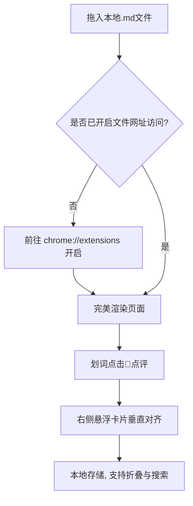

# 欢迎使用 MarkdownFree 🎉

这是一款极轻量、完全运行在本地、免服务器的 **Chrome 浏览器 Markdown 渲染与行内点评器**。

本测试文档包含了一切您需要测试的经典排版、数学公式、流程图以及行内点评功能的样例。

---

## 📖 快速上手与使用教程

### 第一步：开启本地文件网址访问权限 (至关重要)
为了让 Chrome 能够读取并渲染您本地的 `file:///` 文件，请执行以下一次性设置：
1. 在 Chrome 地址栏输入并回车：`chrome://extensions`
2. 找到 **MarkdownFree** 插件，点击 **“详细信息” (Details)**
3. 向下滚动，找到并**开启 “允许访问文件网址” (Allow access to file URLs)** 开关。

### 第二步：打开并阅读本文件
现在，只需把本 `test.md` 文件**拖拽进 Chrome 浏览器**，即可瞬间呈现您眼前的这个精致阅读界面！

---

## 🎨 核心功能体验说明

### 1. 中英独立字体切换与排版 🔠
*   **体验方法**：点击右下角浮动工具栏中的 **“T” 字型字体设置按钮**。
*   **功能亮点**：您可以将**中文字体**与**英文字体**分开独立选择（例如：中文用极富东方雅致的 *华文楷体*，英文用高质感报刊风的 *Georgia*，或者代码用 *Fira Code*）。同时还支持动态调节字号大小，字体配置会自动保存在您的浏览器本地，下次打开任何 md 文件都会自动应用！
*   **页眉与页脚**：页面顶部和底部有点缀得当、极其素雅的灰色边框与浅色文字，绝不喧宾夺主，为您提供极致舒缓的沉浸式阅读仪式感。

### 2. 划词行内点评与高亮 💬
*   **体验方法**：
    1. 用鼠标在此页面上**选择/划取任意一段文字**。
    2. 选区上方会自动浮现出一个毛玻璃气泡按钮 `💬 点评`。
    3. 点击它并输入您的随笔、点评、感悟，然后按确定。
    4. 此时，被选中的文字将被永久高亮标记，并且**对应的点评卡片会在右侧轨道上垂直齐平显示**！
*   **100% 可移植的内嵌存储**：==所有的点评都是直接内嵌在 md 源码中的==<!-- cmt: 哇！我是一条预先内嵌在 test.md 源码里的点评卡片。只要你用 MarkdownFree 打开本文件，我就能自动在这里显身，且完全不破坏其他编辑器里的阅读！ -->。这意味着，即使您关闭浏览器、重命名文件、甚至把文件发给同事，您的点评也绝对不会丢失！
*   **智能写回本地**：当您在 Chrome 里添加或删除点评后，右下角会自动弹出一个带有呼吸指示动画的【💾 磁盘】按钮，同时顶部文件名旁会出现【已修改(未保存)】徽章。点击它或使用快捷键 `Ctrl/Cmd + S` 即可将最新点评无感存回本地磁盘文件！
*   **定位导航**：点击左侧栏的【我的点评】Tab，您会看到该文章所有的点评摘要，点击任何一个，页面都会平滑滚动到高亮所在位置并配合动效闪烁放大！
*   **视图开关**：点击右下角的【消息气泡】按钮，可以一键折叠/显示整个点评侧栏与行内高亮，随时恢复纯净版阅读。

---

## 🔬 渲染高级排版测试

### 代码语法高亮 (Prism.js)
```javascript
// 测试 JavaScript 高亮与优雅的代码圆角
function greetUser(username) {
  const timeOfDay = new Date().getHours() < 12 ? '上午好' : '下午好';
  console.log(`你好, ${username}! 祝你${timeOfDay}阅读愉快。`);
  return {
    status: "success",
    timestamp: Date.now()
  };
}

const stats = greetUser("Hanson Wang");
```

### LaTeX 数学公式渲染 (KaTeX)
行内公式测试：著名的质能方程是 $E = mc^2$，欧拉恒等式为 $e^{i\pi} + 1 = 0$。

块级公式测试（麦克斯韦方程组的一环）：
$$
\nabla \times \mathbf{E} = -\frac{\partial \mathbf{B}}{\partial t}
$$

以及矩阵乘法公式测试：
$$
\begin{pmatrix}
a & b \\
c & d
\end{pmatrix}
\begin{pmatrix}
x \\
y
\end{pmatrix}
=
\begin{pmatrix}
ax + by \\
cx + dy
\end{pmatrix}
$$

### Mermaid 动态图表测试 (Mermaid.js)
这里是由 Mermaid 本地渲染生成的流程图（切换深浅色主题时会自适应配色）：



### 经典表格测试
| 特性 | MarkdownFree | 传统 WebApp | 本地桌面客户端 |
| :--- | :--- | :--- | :--- |
| **启动速度** | 🚀 极速 (拖入直开) | 🐌 慢 (需加载网络资源) | ⏱ 一般 |
| **服务器依赖** | ❌ 零依赖 (100% 本地) | ⚠️ 强依赖 | ❌ 无 |
| **行内点评与高亮** | 💖 卓越 (Medium级右侧悬浮) | ❌ 缺失 | ⚠️ 较弱 |
| **中英字体分开设置** | 🌟 支持 (4-5款经典字体) | ❌ 不支持 | ⚠️ 有限 |

---

## 💡 快捷键小贴士
在非输入状态下，您可以使用以下键盘快捷键快速控制页面：
*   按下 **`T`** 键：快速在【素雅浅色】与【舒适深色】主题之间切换。
*   按下 **`O`** 键：快速展开或收起左侧的【目录大纲】侧边栏。
